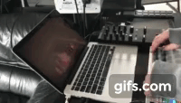

# Unity-MIDI

Utilizing Kijiro Takahashi's Unity Librarys for MIDI I implemented and remapped an Arturia Beatstep Pro to control visual graphics in Unity via CC messages sent from knob inputs on the MIDI controller. 

